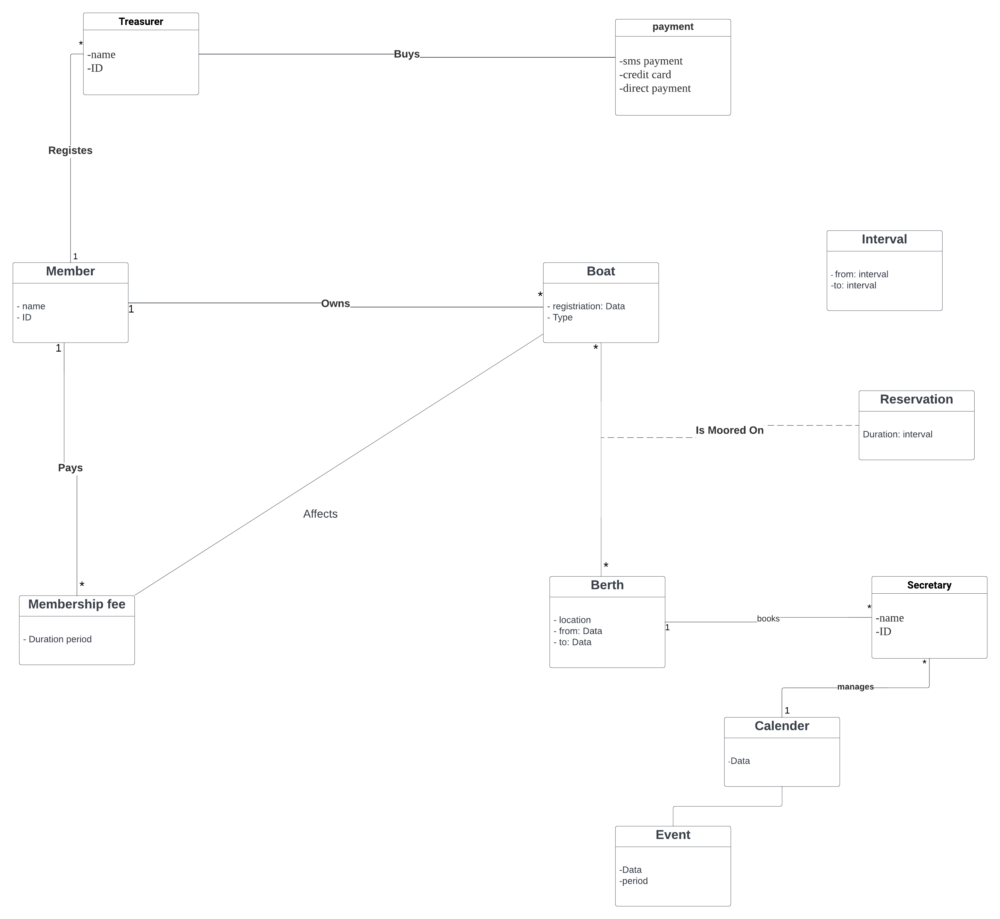

It is grade 3,we use the domain model for grade 2 then we added the payment ways as attributs in the payment class. In this way the member could chosse the paymnent way. WE also added the Treasurer class to the system, and it has an association with Payment class, so the member can pay through the Treasurer. 

Tsnem Mousa  tm222fq@student.lnu.se 

Kim Nygren   kn222fk@student.lnu.se 

Samah Diab   sd222ti@student.lnu.se 