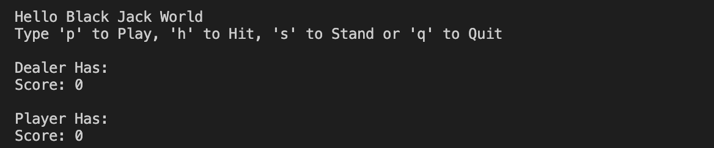
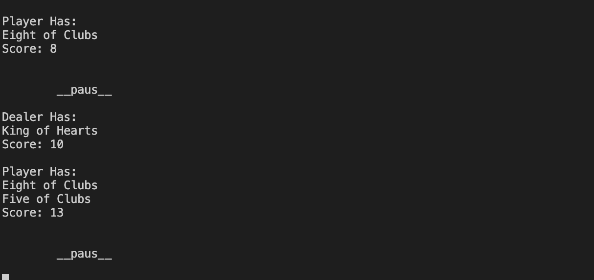
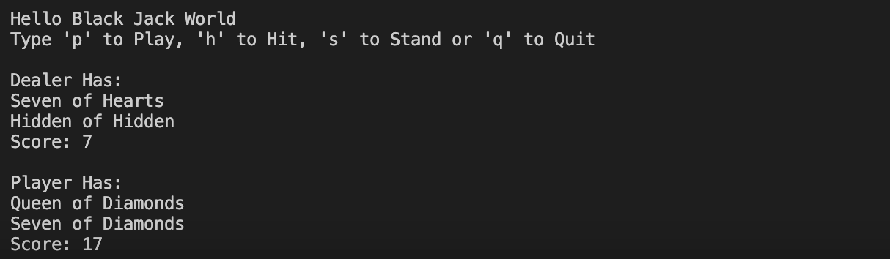
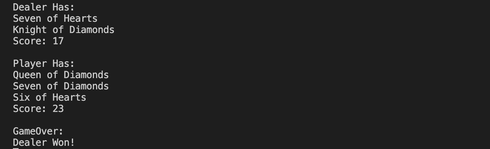

# A3_2_3

Assignment 3, grade 2 and 3.

## Group Members

Kim Nygren  kn222fk@student.lnu.se

Samah Diab  sd222ti@student.lnu.se 

Tsnem Mousa  tm222qf@student.lnu.se

## How To Play BlackJack 

When you start the game the system will ask u to chosse if you want to play ,hit, stand or quit from the game. 

Then the system will pause 2 seconds then it shows the result

 Finally the program will show the result (who won) 

But if you want to play again the system won`t quit by itself, you can chosse p to play one more time.

