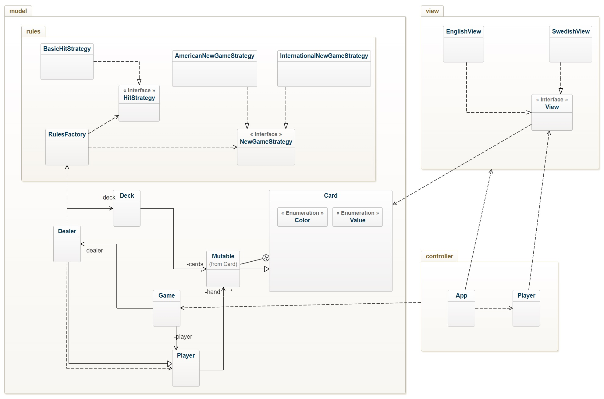
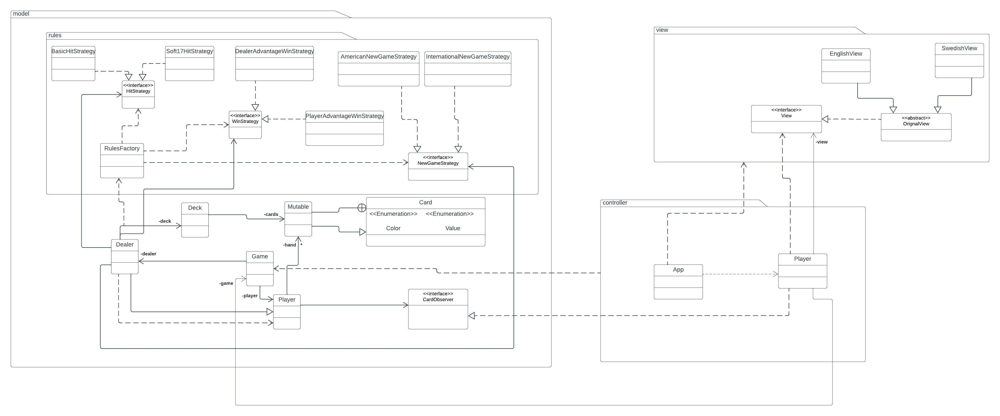

# BlackJack OO-Design
This document describes the current design. Note that some dependencies have been left out for readability reasons. For example there are a lot of dependencies to the Card class.

## Class Diagram
The application uses the model-view-controller (MVC) architectural pattern. The view is passive and gets called from the controller. 

## Stand - Sequence Diagram
This is the detailed sequence diagram for the `Game.stand` method. This is what should be implemented.

## Our updated class diagram

In this class diagram we did add the Soft17HitStrategy class, interface WinStrategy class, then DealerAdvantageWinStrategy and PlayerAdvantageWinStrategy classes that implement the WinStrategy, in the rules package in the domain package.
Then in the domain package we added CardObserver interface(The Player class implements it), and we did add some relations in this package as well.
In the view package we added an abstract class (OrignalView) and the other two classes (EnglishView and SwedishView) will inherit the abstract class that we have.

