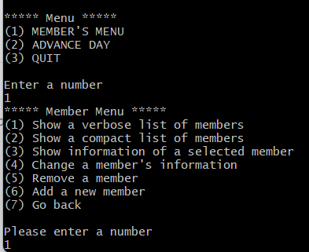
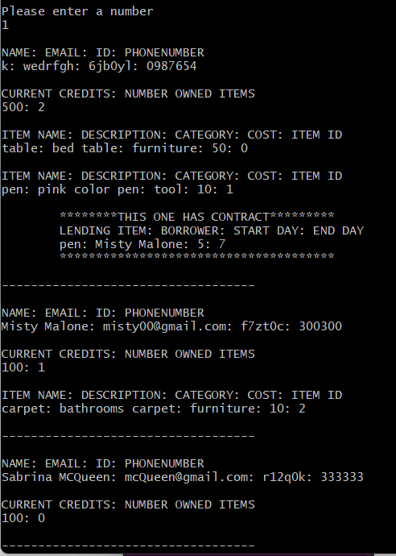
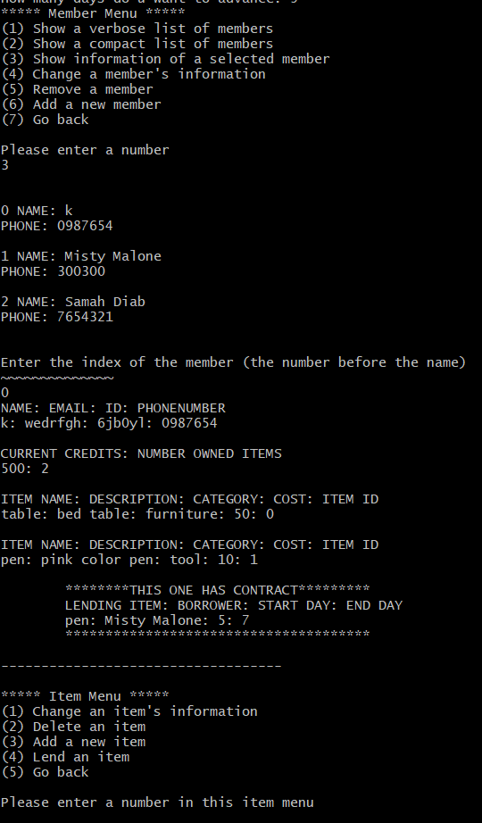
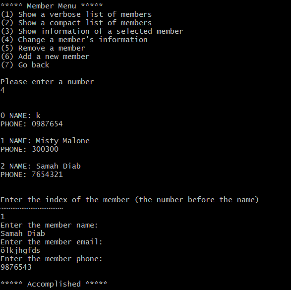
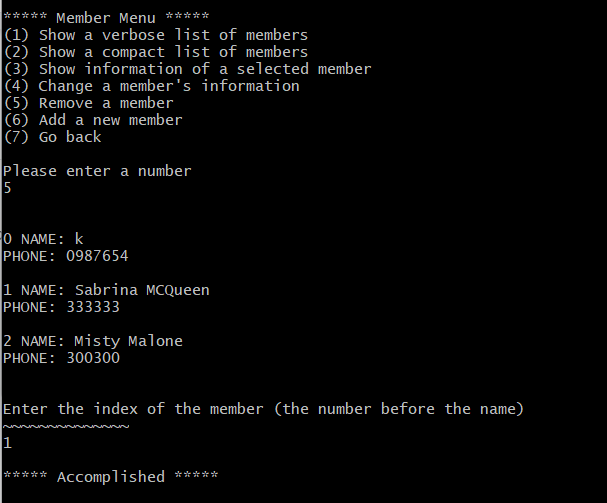
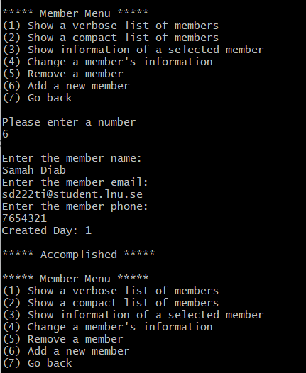
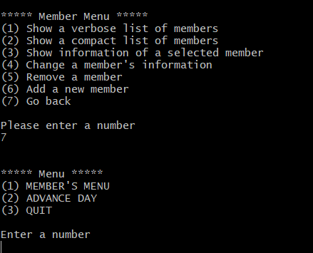
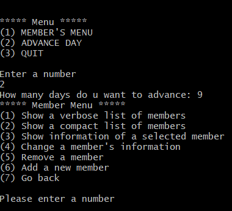
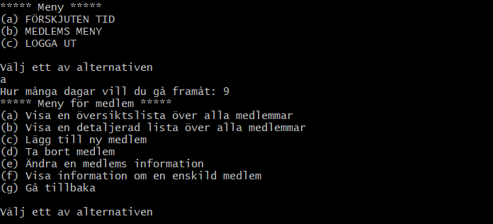

# A2

Project for Assignment 2
Done by Students:

Samah Diab
sd222ti@stusent.lnu.se

Kim Nygren 
kn222fk@student.lnu.se

A project template based on gradle and a gitlab pipeline. You should always build and run the application using gradle regularely.

[design.md](design.md) contains the prescribed architectural design of the application.

## Building
The build must pass by running console command:  
`./gradlew build`  
Note that you should get a report over the quality like:
```
CodeQualityTests > codeQuality() STANDARD_OUT
    0 CheckStyle Issues in controller/App.java
    0 CheckStyle Issues in controller/Simple.java
    0 CheckStyle Issues in model/Simple.java
    0 CheckStyle Issues in view/Simple.java
    0 FindBugs Issues in controller/App.java
    0 FindBugs Issues in model/Simple.java
    0 FindBugs Issues in view/Simple.java
    0 FindBugs Issues in controller/Simple.java
```

Removing or manipulating the code quality checks results in an immediate assignment **Fail**. 

## Running
The application should start by running console command:  
`./gradlew run -q --console=plain`
## How to run the application 

## English View



#### List of members
##



#### Show member's information
##



#### Change member's information 
##




#### How to remove a member 
##




#### How to add a new member
##



#### GO back 
## 




#### Advance time 
##




## Swedish View

### The swedish view works in the same way as english view, but the user needs to input letters instead of numbers
##




## Adding Your Own Code
The `Simple` classes project should likely be removed do not forget to also remove the test case associated to `model.Simple`.  

Add your own code to the packages respectively and feel free to add automatic test cases for your own code. A good process is to design a little - code a little - test a little one feature at a time and then iterate.

## Versioning

Adhere to the git versioning instructions according to the assignment.

## System test
Adhere to the instructions according to the assigment.

## Handing In
Adhere to the instructions according to the assigment.